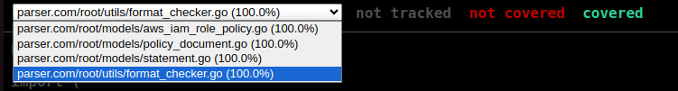

# JsonParser in AWS::IAM::ROLE Policy format

# Assumptions

## Format
Reading the AWS Documentation I came to conclusion that this is the proper format for this problem:
```
AWS::IAM::ROLE Policy 
{
  "PolicyName": string that matches the regex: [\w+=,.@-]+ 
  "PolicyDocument": JSON
}
```
```
The PolicyDocument:
{
    "Version": string
    "Statement": List of Statements/Policies  
}
```
```
StatementObject:
{
    "Sid": Optional field, if presented it's a string
    "Effect": "Allow" or "Deny" only
    "Principal": map - string as a key and string or list as a value
    "Action": string or list of strings
    "Resource": string or list of strings
    "Condition": map - string key and map as a value. Inner map has key as a string and string as value
}
```

So the entire model ( in pseudocode ) looks like this:

~~~

{
  "PolicyName": String matching the regex [\w+=,.@-]
  "PolicyDocument": {
    "Version": String
    "Statement": [{
      "Sid": Optional[String],
      "Effect": String - ("Allow" or "Deny"),
      "Principal": Optional[Map[String][String or List of Strings]],
      "Action": String or List of Strings,
      "Resource": String or List of Strings,
      "Condition": Optional[Map[String]Map[String]String]
    }]
  }
}
~~~

All of the assumptions comes from [AWS Documentation](https://docs.aws.amazon.com/IAM/latest/UserGuide/access_policies.html#access_policies-json) from *JSON policy document structure* and *Multiple statements and multiple policies* sections. The presumptions are based on examples from documentations, because AWS did not specify types of all fields.

## Structure of project

```
├── .gitignore                                         -- Gitignore file
├── go.mod                                             -- Module initialization
├── inputs                                             -- DIrectory with json examples which are may be ran in main.go
│   ├── aws_iam_role_policy.json -- my json example
├── main.go                                            -- Main file  of project
├── models                                             -- Directory with defined structures and functions to unmarshall the objects
│   ├── aws_iam_role_policy.go                         -- AWS::IAM:Role Policy model
│   ├── policy_document.go                             -- Policy Document model 
│   └── statement.go                                   -- Statement model
├── README.md 
└── tests                                              -- Directory with tests
    ├── model_tests                                    
    │   ├── aws_iam_role_policy_parser_test.go         -- Tests for all methods in .go
    │   └── jsons                                      -- Directory with json used in tests
    │       ├── aws_iam_role_policy                    -- AWS::IAM:Role Policy JSON examples
    │       │   ├── policy_name_not_matches_regex.json
    │       │   ├── policy_name_not_string.json
    │       │   └── ...
    │       ├── policy_documents                       -- PolicyDocuments JSON examples
    │       │   └── ...
    │       └── statements                             -- Statements JSON examples
                └── ...   
    ├── policy_document_parser_test.go                 -- Tests for Policy Document model
    ├── statement_parser_test.go                       -- Tests for Statement model
    └── utils_tests                                    -- Tests for utils modules
        └── format_checker_test.go                     -- Tests for format_checker file
└── utils                                              -- Directory with utilities
    └── format_checker.go                              -- Directory with helpful functions
```

## How to run the parser

Add your json file into **inputs** directory. Next, in **main.go** in line 45 in function `CheckJSONFormat` change the path to your json file for example: **"inputs/your_json_file_name.json"**


## Docstrings

I have addded docstring for all methods in all modules (except for tests) so I hope it will help you to understand the code. 

## Tests

I have written tests for all my functions and got 100% test coverage


If you want to run tests you can manage that using command:

```bash
go test ./tests/*
```
or with coverage
```bash
go test ./tests/... -v -coverpkg=./... -coverprofile=coverage.out
go tool cover -html coverage.out 
```
Those commands will open the html page with test coverage (I recommend using google chrome, because on mozzila firefox it did not work)